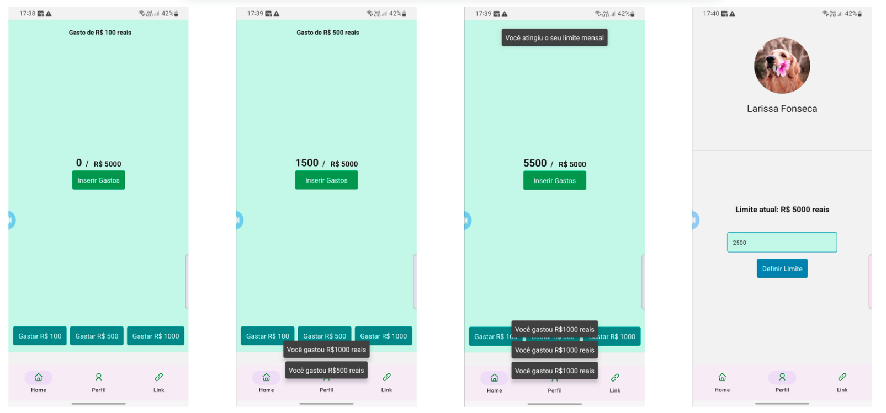

# Cash Controll - App Mobile de Controle Financeiro

  

**Cash Controll** é um aplicativo móvel desenvolvido para ajudar no gerenciamento de seus gastos mensais. Através de uma interface simples e intuitiva, o app permite que o usuário registre suas despesas, visualize seu perfil e tenha acesso a dicas financeiras.

## Funcionalidades

- **Inserir Gastos:** Registre seus gastos facilmente com valores pré-definidos (R$100, R$500, R$1000) ou insira um valor personalizado.
- **Perfil:** Acesse e edite seu perfil para ajustar o limite mensal de gastos.
- **Dicas de Economia:** Receba dicas para otimizar seus gastos e economizar, com um link direto para um blog especializado.

## Como Usar

1. **Home:** A tela principal oferece uma visão geral do seu controle financeiro. Aqui você pode adicionar seus gastos e monitorar seu progresso.
2. **Perfil:** Acesse seu perfil para ajustar seu limite de gastos mensal.
3. **Dicas de Economia:** Na aba "Dicas", clique no link para acessar um artigo com dicas sobre como economizar dinheiro.

## Navegação

O aplicativo usa uma navegação por abas, com as seguintes opções:

- **Home:** Exibe a tela inicial com o painel de controle.
- **Perfil:** Permite editar o seu perfil e configurar limites de gastos.
- **Dicas:** Redireciona para um link com dicas financeiras úteis.

## Tecnologias Utilizadas

- **React Native:** Framework para desenvolvimento mobile.
- **React Navigation:** Para navegação entre telas com abas.
- **NativeBase:** Para componentes de UI como `Link`, `VStack`, e outros.
- **React Icons:** Usado para ícones nas abas de navegação.
